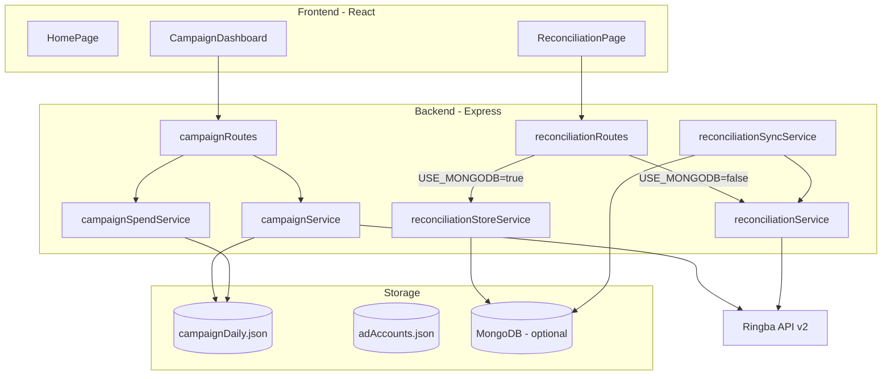

# Architecture

## Overview



## Backend services

| Service | Role |
|---------|------|
| `ringbaClient.js` | HTTP client. Auth: `Token {token}` (Bearer fallback on 401) |
| `ringbaCampaignService.js` | Campaign list from Ringba |
| `ringbaInsightsService.js` | Daily/period insights rollups |
| `campaignService.js` | Merges Ringba metrics + BIGO spend |
| `campaignSpendService.js` | Read/write `campaignDaily.json` (per traffic source) |
| `trafficSourceService.js` | Traffic source config (BIGO, FB, Google) |
| `spendProviders/index.js` | API provider registry (FB/Google stubs) |
| `adAccountService.js` | Read `adAccounts.json` |
| `reconciliationService.js` | Live Ringba insights + paginated call logs |
| `reconciliationStoreService.js` | Read reconciliation from MongoDB |
| `reconciliationSyncService.js` | Ringba → MongoDB weekly snapshots |

## Frontend

| File | Role |
|------|------|
| `App.jsx` | Routes, header, theme toggle |
| `CampaignDashboard.jsx` | Filters, KPI cards, table, BIGO spend modal |
| `ReconciliationPage.jsx` | Filters, summary, sold calls, CSV download |
| `api.js` | Axios client to backend |
| `csvExport.js` | Client-side sold-call CSV download |

## Date handling

`backend/src/utils/dateRange.js`:

- `getLastWeekRange()` — prior business week (Sun–Fri window for reconciliation defaults)
- `buildReportWindow()` — Ringba UTC report window aligned to America/New_York

Uses **local date strings** (`YYYY-MM-DD`) to avoid UTC off-by-one bugs.

## Ringba auth

Set in `backend/.env`:

```env
RINGBA_ACCOUNT_ID=RA...
RINGBA_API_TOKEN=...
```

Insights requests use POST with an **object** body (not an array). Call logs require pagination (`offset` + `size: 150`) to fetch all records.

## Legacy code (not mounted)

- `kpiRoutes.js` / `DailyKpiPage.jsx` — old ad-group KPI flow using `manualSpend.json`
- Not wired in `server.js` or `App.jsx`

Use Campaign Performance + BIGO spend instead.
